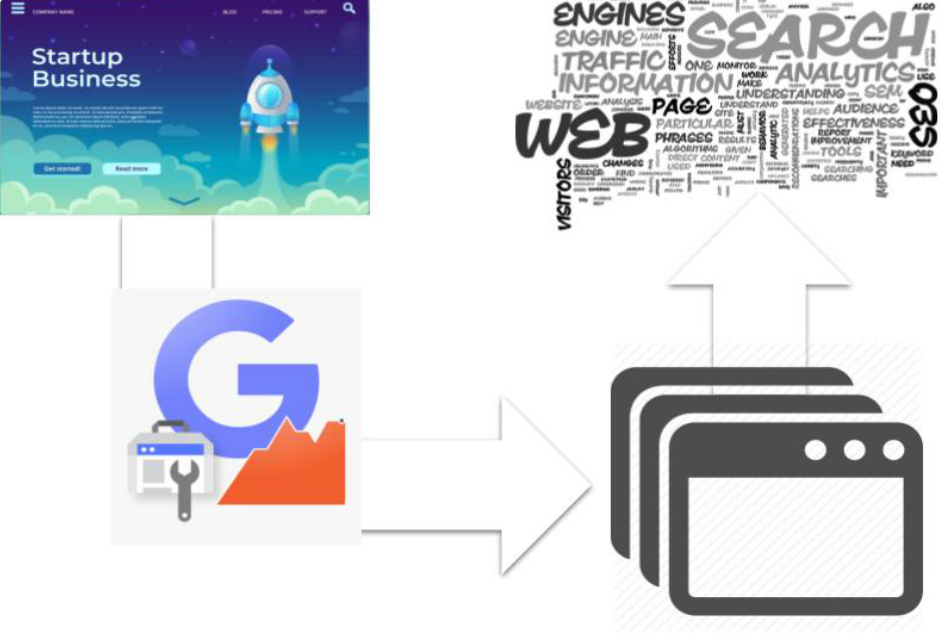
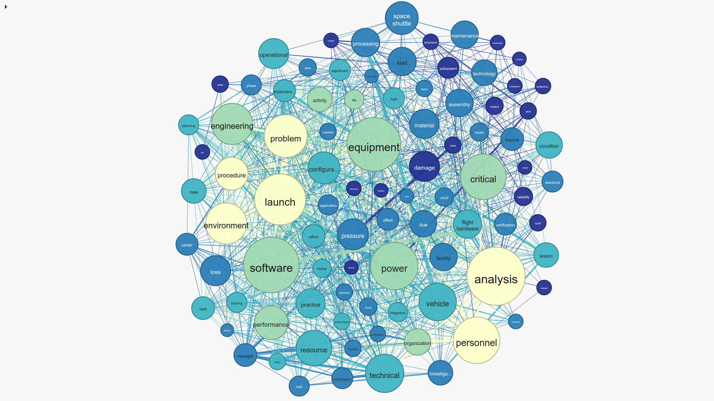

# ADvantange
If you have tried to push forward a SEO campaign in a field  that moves
quickly, you might find that tools such as Google Keyword Planner (GPK)
might not give you the most comprehensive set of keywords to select
from. In fact, Google itself have manifested that over 15% of queries 
submitted have never been seen before by the search engine, and therefore
not available for the GKP ranking. The ADvantage app fills this gap by 
leveraging the information of your landing page, and links therein, to 
search for related **current** content to construct an up-to-date text 
corpora. It then uses Natural Language Processing (NLP) text 
summarization through TextRank. This will leave you with two long sets of
keywords: The GKP-suggested set, and the extended ADvantage set. 
ADvantage go then to optimize the best basket of words to minimize your
daily cost and cost per click (CPC), while maximizing daily impressions,
ad index position, and daily clicks. ADvantage does this through 
combinatorial optimization using the branch and bound algorithm. This 
optimization will guarantee you the best set of words (given the 
statistics) even if no better words are found through web scraping.

In this README you will find:
1. [Think of the cost](#think-of-the-cost): Brief explanation of the 
business value of ADvantage
2. [Local setup](#local-setup): how to setup the local version of 
ADvantage and some
comments on the online version.
3. [Using the web-App](#using-the-web-app): Limited hosting of the 
through web is available 
4. [How does it work?](#how-does-it-work): A more detailed explanation 
of the methods used by ADvantage
5. [Credentials for third party API](#credentials-for-third-party-api):
previous to setting up the app, make sure you have these credentials
6. [I would love to hear from you](I-would-love-to-hear-from-you): The 
feedback section!

## Think of the cost
Google ads work by bidding on keywords. This means that in order to have
your campaign to be on top of the list when the keyword has been engaged, 
you will need to outbid your competitors for that specific set of keywords.
This drives the prices of certain words up, while leaving related, yet 
potentially useful words out for grabs. This tool aims to help you reduce
the cost of your campaigns while keeping track of new topics and 
associated keywords. ADvantage will provide you with an interactive 
dashboard, where you can update the daily cost you are allowed (or want)
to spend. Once the desired basket of words of your choice have been 
identified, you can download the associated table for you to proceed 
with the campaign.

## Local setup
To run it locally, you just need to type in a terminal:
```bash
python3 -m pip install ad_vantage
```
Type `ad_vantage.py -h` to see help.

Alternatively, you can clone this repo by:
```bash
git clone ...
```
You then have to move to the ADvantage folder, and include it into your
PYTHONATH:
```bash
cd ADvantage
echo 'export PYTHONPATH=$PYTHONPATH:$PWD' >> ~/.bashrc
source ~/.bashrc
```
This works in unix-like terminals such as linux and macs.

## Using the web-App
A front-end have been developed, but is very limited in the number of 
queries that can be done. This service can be reached through [
https://advantage.org](https://advantage.org)

## How does it work?
ADvantage works in three modules:
1. [Get similar content](#get-similar-content)
2. [Extract keywords](#extract-keywords)
3. [Combinatorial optimization](#combinatorial-optimization)

###  Get similar content
Based on your landing page, ADvantage will use the GOOGLE API to search 
for the top 100 similar web pages. ADvantage will then proceed to scrape
the text and crawl the local links. The crawling process is repeated up
to depth 5 to  avoid spurious connections. Links pointing to javascript
apps, mailtos, and web names with ideograms are ignored. The scraped 
text is assembled into a corpus for further analysis

<p align="center">

</p>
### Extract keywords
With the corpus assembled, ADvantage proceeds to remove stopwords 
(including an extension to the one provided in most packages), 
punctuation and non text characters. A Natural Language Processing (NLP)
text summarization using TextRank is used to identify the keywords. 

<p align="center">
  
</p>


TextRank works as follows:
1. Compute the similarity matrix between sentences/words by 
co-localization: If two words/sentences are found toguether more often,
a one is inputted in the matrix.
2. Assume the matrix as an adjacency matrix in an undirected (there are
directed variations, such as PageRank, but `gensim` uses undirected) 
graph. This graph will have nodes being words/sentences and edges being 
colocalization of those words/sentences with the neighboring one
3. Score: based on the centrality of each node (which one is the node 
that best connect all others), the ranking is performed and the keywords
are selected. Singletons (nodes that have no connections) are ignored.

### Combinatorial optimization
The two steps above will give you a large set of keywords. Even if only 
using the Google keyword planner, the number of words might be in the 
hundreds. The question is then how can we get a basket of words that
maximizes impressions and clicks, while minimizing the daily cost. 
ADvantage uses a branch and bound solution to this combinatorial 
optimization problem. In brief, branch and bound work by ...


## Credentials for third party API
To get the apropriate statistics of the keywords, ADworks required the 
use of a third party (paid) API called [Data for SEO](www.dataforseo.com
). 
In order to effectively use ADvantage, you need to create an account and
provide the credentials at each call. 


## I would love to hear from you
If you have any feedback feel free to open an issue in github or senf me
an email at jshleap \[at] gmail \[dot] com. If you use this in a current
SEO campaign I would love to hear how did ADvantage worked for you, 
especially gains or losses of impressions on your campaign.


